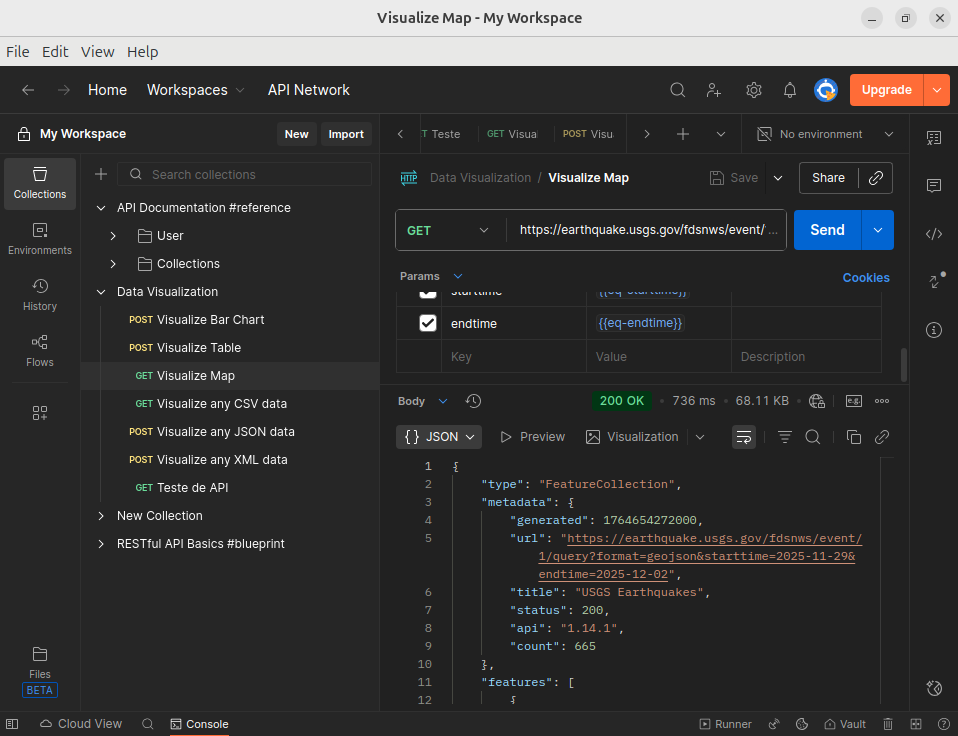

# Teste de API - USGS Earthquake

Este projeto contém **testes simples de API** realizados utilizando **Postman**, com o objetivo de praticar e demonstrar habilidades em **QA e automação de testes**.

## API Testada

- **API:** [USGS Earthquake API](https://earthquake.usgs.gov/fdsnws/event/1/)  
- **Método HTTP:** GET  
- **Objetivo:** Validar endpoints, verificar respostas e status de requisição.

## Print do Teste

> Teste simples realizado no Postman, com requisição GET e status 200 OK. Esse teste faz parte do **portfólio de QA em evolução**, mostrando prática com APIs e validação de respostas.

## Ferramentas

- **Postman:** Para envio de requisições e validação de respostas.  
- **GitHub:** Para armazenar e documentar o projeto como portfólio.

## Objetivo do Projeto

- Aplicar conceitos de **teste de API** e validação de endpoints.  
- Registrar resultados de requisições (status 200 OK, dados retornados).  
- Criar um **portfólio gradual de testes**, evoluindo para métodos mais complexos e automação.

## Próximos Passos

- Adicionar testes com métodos **POST, PUT e DELETE**.  
- Criar **coleções automatizadas no Postman**.  
- Incluir scripts de validação e testes mais avançados.  
- Documentar cada teste com prints, resultados e aprendizado.

---

Este é um projeto em evolução, mostrando **minha prática contínua em QA e automação de testes**.
